# Floating Settings Panel (System Config Overlay)

## Overview

Add a floating cog button to the top-right corner of every screen. Clicking it opens an animated Window overlay panel that serves as the app's control center with five sub-pages: Sound Settings, Account, Shop, Notifications, and Inventory. The panel uses a menu-list-to-detail-view navigation pattern with `sidewaysFlashVariants` transitions, a dither-pattern backdrop, and the standard Window component aesthetic.

This plan integrates with the [points system spec](../brainstorms/2026-03-02-points-system-brainstorm.md) for balance display and shop purchases.

## Problem Statement / Motivation

The app currently has:
- A sound muting system (`soundEngine.setMuted()`) with **no UI toggle** (TODO.md item)
- No account/profile management — the operator name is the email prefix with no way to customize it
- No shop or rewards UI despite points/milestones being planned
- No notification system for streak achievements or purchases
- No settings page of any kind

Users need a unified, always-accessible control center that doesn't disrupt their workflow by navigating away from the current page.

## Proposed Solution

A client-side overlay panel injected at the root layout level, floating above all page content. The panel is a new UI paradigm for this app (no modals/overlays exist yet) and establishes patterns for future overlay features.

### Architecture

```
app/layout.tsx
  <ClerkProvider>
    <body>
      <RetroSoundController />
      <SettingsPanelProvider>         <!-- NEW: context for panel state -->
        <div.flex-1>
          <PageTransition>{children}</PageTransition>
        </div>
        <Footer />
        <SettingsCog />              <!-- NEW: fixed-position cog button -->
        <SettingsPanel />            <!-- NEW: overlay panel + backdrop -->
      </SettingsPanelProvider>
    </body>
  </ClerkProvider>
```

**Key architectural decisions** (see brainstorm):
- Panel lives **outside** `PageTransition` so it persists across route changes
- Panel closes automatically on route navigation
- Uses `position: fixed` with `z-[100]` (safely between existing `z-1` and `z-[9999]` scanline)
- Data fetched via **server actions** (matches existing patterns in `app/dashboard/actions.ts`)
- Auth state checked client-side via Clerk's `useAuth()` hook

### Component Tree

```
SettingsPanelProvider (context: open/closed, activePage, unreadCount)
├── SettingsCog (fixed button, top-right, shows unread badge)
└── SettingsPanel (AnimatePresence wrapper)
    ├── Backdrop (dither-50 pattern, click-to-close)
    └── Window (standard component, centered)
        ├── SettingsMenu (landing: list of [ SOUND ] [ ACCOUNT ] etc.)
        ├── SoundSettings (mute toggle + sound pack selector)
        ├── AccountSettings (alias, email, password, sign-out)
        ├── ShopView (item grid with SVG previews + purchase flow)
        ├── NotificationsView (reverse-chronological feed)
        └── InventoryView (owned items, equip/activate)
```

## Technical Approach

### Implementation Phases

#### Phase 1: Foundation — Cog Button + Empty Panel Shell

**Goal:** Floating cog visible on all screens, opens/closes an empty Window overlay with backdrop.

**Files to create:**
- `components/SettingsPanel/SettingsPanelProvider.tsx` — React context: `{ isOpen, activePage, openPanel, closePanel, navigateTo, goBack }`
- `components/SettingsPanel/SettingsCog.tsx` — Fixed-position cog button (top-right), uses `Settings` icon from `lucide-react`
- `components/SettingsPanel/SettingsPanel.tsx` — Overlay container: backdrop + animated Window
- `components/SettingsPanel/SettingsMenu.tsx` — Landing menu list with bracket labels
- `components/SettingsPanel/index.ts` — Barrel exports
- `utils/animations.ts` — Add `scaleUpVariants` (new variant with dynamic `transformOrigin`)

**Files to modify:**
- `app/layout.tsx` — Wrap content in `SettingsPanelProvider`, add `SettingsCog` and `SettingsPanel`

**Animation details:**
- **Panel open**: `scale: 0 → 1` with `transformOrigin` calculated from cog button's `getBoundingClientRect()` at click time. Stepped easing (8 steps), 0.4s duration.
- **Panel close**: Reverse scale-down to cog position. 0.3s duration.
- **Backdrop**: `opacity: 0 → 1` fade with `dither-50` CSS class applied to a full-screen fixed div.
- **Sub-page transitions**: Reuse `sidewaysFlashVariants` with `direction` param for forward/back navigation.

**Backdrop implementation**: Use the existing `dither-50` class (checkerboard pattern from `app/styles/patterns.css`) on a `fixed inset-0` div. This stays true to the 1-bit design system — no semi-transparent rgba needed (see brainstorm: dim + block decision). Add `pointer-events: auto` and `onClick={closePanel}`.

**Accessibility:**
- `role="dialog"` + `aria-modal="true"` + `aria-label="System Configuration"` on the panel
- Focus trapped inside the panel while open (use a lightweight focus-trap util)
- `Escape` key closes the panel
- Focus returns to the cog button on close
- Menu items are `<button>` elements with proper focus styles

**Mobile:**
- Cog button: `fixed top-3 right-3` with `safe-area-inset` padding
- Panel: on viewports below `md` (768px), the Window takes `w-[calc(100%-2rem)]` and is centered
- Standard Window sizing on desktop

**Success criteria:**
- [ ] Cog visible on all screens (landing, login, signup, dashboard, create-habit, edit-habit)
- [ ] Cog hidden on `/sso-callback` (transient auth redirect page)
- [ ] Click cog → panel scales up from cog position with dither backdrop
- [ ] Click backdrop or press Escape → panel closes, focus returns to cog
- [ ] Menu shows 5 items; navigating to any shows placeholder "COMING SOON" detail view
- [ ] `sidewaysFlashVariants` animates forward/back transitions between menu and detail views
- [ ] Panel closes on route change (listen to `pathname` via `usePathname()`)
- [ ] Focus is trapped inside the panel while open
- [ ] Works on mobile (tested at 375px width)

---

#### Phase 2: Sound Settings + SoundEngine Fixes

**Goal:** Working mute toggle with localStorage persistence. Fix existing SoundEngine gap.

**Files to create:**
- `components/SettingsPanel/SoundSettings.tsx` — Mute toggle UI

**Files to modify:**
- `utils/sound-engine.ts`:
  - Add `get muted(): boolean` public getter (currently only `setMuted()` exists)
  - Read `localStorage.getItem('sound-muted')` in constructor to initialize `isMuted`
  - Write to `localStorage` inside `setMuted()` for persistence
- `components/SettingsPanel/SettingsMenu.tsx` — Wire up `[ SOUND ]` menu item to `SoundSettings`

**Sound toggle UI:**
- Retro-styled toggle: `[ SOUND: ON ]` / `[ SOUND: OFF ]` using `btn-retro` styling
- Reads initial state from `soundEngine.muted`
- Calls `soundEngine.setMuted(!current)` on toggle
- Uses `data-custom-sound="true"` to prevent the toggle click from playing a sound while muting

**Future-proofing for sound packs:**
- Sound pack selector is **not built in this phase** — just the mute toggle
- The `SoundSettings` component renders a `// Sound pack selector will go here` placeholder below the toggle
- Sound pack equipping (Phase 5: Inventory) will require refactoring `SoundEngine` to accept parameterized oscillator configs — that work belongs in Phase 5

**Success criteria:**
- [ ] Mute toggle works: clicking toggles all app sounds on/off
- [ ] Mute state persists across page refreshes (localStorage)
- [ ] Mute state persists across browser sessions
- [ ] SoundEngine reads stored preference on initialization (fixes existing bug)
- [ ] Toggle uses `data-custom-sound="true"` to avoid playing click sound while muting

---

#### Phase 3: Account Settings + User Profiles Table

**Goal:** Users can set a custom operator alias and manage their account.

**Database migration — `user_profiles` table:**
```
user_profiles
├── user_id (text, PK, matches Clerk user ID)
├── alias (text, nullable, max 32 chars)
├── active_theme_id (uuid, nullable, FK → shop_items.id) -- used in Phase 5
├── active_sound_pack_id (uuid, nullable, FK → shop_items.id) -- used in Phase 5
├── created_at (timestamptz, default now())
└── updated_at (timestamptz, default now())

RLS: SELECT/INSERT/UPDATE WHERE user_id = auth.uid()
```

**Files to create:**
- `components/SettingsPanel/AccountSettings.tsx` — Account management UI
- `app/settings/actions.ts` — Server actions: `getProfile()`, `updateAlias(alias)`

**Files to modify:**
- `components/SettingsPanel/SettingsMenu.tsx` — Wire up `[ ACCOUNT ]` to `AccountSettings`
- `components/Dashboard/DashboardClient.tsx` — Replace email-prefix operator name with alias from `user_profiles` (falls back to email prefix if no alias set)
- `app/dashboard/page.tsx` — Fetch alias in server component, pass as prop

**Account UI sections:**
1. **OPERATOR ALIAS**: Text input (`input-retro` class), 32-char max, alphanumeric + spaces + underscores. Save button. Shows current alias or email prefix as placeholder.
2. **EMAIL**: Read-only display of `user.emailAddresses[0].emailAddress`. No edit — Clerk manages this.
3. **PASSWORD**: `[ CHANGE PASSWORD ]` button. Opens Clerk's password change flow via `clerk.openUserProfile()` or redirects to Clerk's hosted account page.
4. **EXIT SYSTEM**: `[ EXIT SYSTEM ]` sign-out button. Calls `signOut()` from `useClerk()`, closes panel first, then navigates to `/login`.

**Auth-gated behavior:**
- When logged out, `[ ACCOUNT ]` menu item shows as disabled (opacity reduced, `aria-disabled="true"`)
- Tapping a disabled item shows inline text: `> LOGIN REQUIRED` below the menu item (no toast/redirect — keeps it simple)
- Same disabled pattern applies to Shop, Notifications, Inventory

**Sign-out sequence** (addresses race condition from SpecFlow):
1. Close panel (triggers close animation)
2. After animation completes (`onAnimationComplete`): call `router.push('/login')`
3. After navigation: call `signOut()`

**Success criteria:**
- [ ] User can set and update their operator alias
- [ ] Alias replaces email prefix as OPERATOR name on the dashboard
- [ ] Alias persists across sessions (stored in DB)
- [ ] Email displayed as read-only
- [ ] Password change triggers Clerk flow
- [ ] Sign-out closes panel cleanly before navigating
- [ ] Disabled items show `> LOGIN REQUIRED` text, are `aria-disabled`
- [ ] `user_profiles` table created with RLS policy

---

#### Phase 4: Notifications + Notification Generation

**Goal:** In-app notification feed for streak milestones and purchase confirmations, with unread badge on the cog.

**Database migration — `notifications` table:**
```
notifications
├── id (uuid, PK, default gen_random_uuid())
├── user_id (text, NOT NULL)
├── type (text, NOT NULL) -- 'streak_milestone' | 'purchase'
├── message (text, NOT NULL) -- e.g., "7-DAY STREAK: MORNING RUN"
├── metadata (jsonb, nullable) -- { habit_id, streak_count, item_id, etc. }
├── read (boolean, default false)
├── created_at (timestamptz, default now())

RLS: SELECT/UPDATE WHERE user_id = auth.uid()
Index: (user_id, read) WHERE read = false -- for fast unread count
```

**Files to create:**
- `components/SettingsPanel/NotificationsView.tsx` — Notification feed UI
- `app/settings/actions.ts` (extend) — `getNotifications(limit)`, `getUnreadCount()`, `markAllRead()`, `createNotification(type, message, metadata)`

**Files to modify:**
- `app/dashboard/actions.ts` — Inside `commitHabitLog`: after point event insertion (Phase 4 assumes points system is built per its own spec), check streak milestones and create notification records
- `components/SettingsPanel/SettingsCog.tsx` — Show unread badge (small filled dot) when `unreadCount > 0`
- `components/SettingsPanel/SettingsPanelProvider.tsx` — Fetch unread count on mount + after panel close (if mutations happened)

**Notification generation logic** (inside `commitHabitLog` on check):
1. After inserting point_event for a milestone (the 23505 duplicate check from the points spec tells us if this is a new milestone)
2. If milestone is new: call `createNotification('streak_milestone', '${STREAK_COUNT}-DAY STREAK: ${HABIT_TITLE}', { habit_id, streak_count })`
3. Purchase notifications are created in the shop purchase action (Phase 5)

**Notification feed UI:**
- Reverse-chronological list, limited to last 50 entries
- Each entry: type icon (star for milestone, cart for purchase) + message + relative timestamp (`3H AGO`, `2D AGO`)
- Unread entries have a bold/inverted style; read entries are normal weight
- `[ MARK ALL READ ]` button at top
- Empty state: `NO TRANSMISSIONS RECEIVED` centered text
- Mark-as-read trigger: entering the notifications view calls `markAllRead()` after a 2-second delay (prevents premature marking if user immediately backs out)

**Unread count refresh strategy:**
- Fetch on app load (in `SettingsPanelProvider` mount)
- Re-fetch when panel opens
- Re-fetch after habit completion (pass a refresh trigger from dashboard)
- No polling — acceptable staleness for this use case

**Success criteria:**
- [ ] Notifications table created with RLS and unread index
- [ ] Streak milestone notifications generated automatically on habit completion
- [ ] Unread badge (dot) visible on cog when notifications exist
- [ ] Notification feed displays reverse-chronological entries with relative timestamps
- [ ] `[ MARK ALL READ ]` clears unread state
- [ ] Empty state shown when no notifications
- [ ] Unread count refreshes on panel open and after habit completion
- [ ] Max 50 notifications displayed (pagination not needed for v1)

---

#### Phase 5: Shop + Inventory + Purchases

**Goal:** Browse shop items, purchase with points, equip cosmetics from inventory.

**Database migrations:**

```
shop_items
├── id (uuid, PK, default gen_random_uuid())
├── name (text, NOT NULL)
├── category (text, NOT NULL) -- 'theme' | 'sound_pack'
├── cost (integer, NOT NULL)
├── description (text)
├── preview_svg (text) -- inline SVG string for thumbnail
├── config (jsonb) -- theme: CSS variable overrides; sound_pack: oscillator params
├── sort_order (integer, default 0)
├── created_at (timestamptz, default now())

RLS: SELECT for all authenticated users (public catalog)
No INSERT/UPDATE/DELETE via client — admin-only via migrations/seed data
```

```
user_purchases
├── id (uuid, PK, default gen_random_uuid())
├── user_id (text, NOT NULL)
├── item_id (uuid, NOT NULL, FK → shop_items.id)
├── purchased_at (timestamptz, default now())

RLS: SELECT/INSERT WHERE user_id = auth.uid()
Unique constraint: (user_id, item_id) -- can't buy same item twice
```

**Files to create:**
- `components/SettingsPanel/ShopView.tsx` — Shop catalog grid
- `components/SettingsPanel/ShopItemCard.tsx` — Individual item display (SVG preview + name + cost)
- `components/SettingsPanel/PurchaseConfirmDialog.tsx` — "PURCHASE [X] FOR [N] PTS?" confirmation
- `components/SettingsPanel/InventoryView.tsx` — Owned items list with equip toggle
- `app/settings/actions.ts` (extend) — `getShopItems()`, `getUserPurchases()`, `purchaseItem(itemId)`, `equipItem(itemId, category)`, `unequipItem(category)`

**Files to modify:**
- `components/SettingsPanel/SettingsMenu.tsx` — Wire up `[ SHOP ]` and `[ INVENTORY ]`
- `components/SettingsPanel/SettingsMenu.tsx` — Show points balance next to `[ SHOP ]` or at top of menu

**Purchase flow:**
1. User browses shop catalog (grid of `ShopItemCard` components)
2. Each card shows: SVG thumbnail, name, cost in points, "OWNED" badge if already purchased
3. Clicking an unowned item opens `PurchaseConfirmDialog`: `PURCHASE [ITEM] FOR [X] PTS? [ YES ] [ NO ]`
4. If insufficient points: buy button disabled, shows `INSUFFICIENT CREDITS`
5. On confirm: server action `purchaseItem(itemId)` runs:
   a. Verify user has enough points (read `user_points.balance`)
   b. Insert into `user_purchases` (unique constraint prevents double-buy)
   c. Decrement `user_points.balance` by item cost
   d. Create purchase notification
   e. Return success/failure
6. On success: item card updates to show "OWNED", balance updates
7. On failure (race condition, insufficient points): show error message inline

**Inventory UI:**
- Two sections: `VISUAL_THEMES` and `SOUND_PACKS`
- Each owned item shows: name + `[ EQUIP ]` or `[ EQUIPPED ]` button
- Equipping sets `user_profiles.active_theme_id` or `active_sound_pack_id`
- Only one per category — equipping a new one auto-deactivates the previous
- `[ UNEQUIP ]` returns to default (null value in DB)
- Default state (no equipped items): standard black/white theme, default sound engine params

**Empty states:**
- Shop with zero items: `SUPPLY CACHE EMPTY // CHECK BACK LATER` with a retro terminal aesthetic
- Inventory with zero items: `NO ACQUISITIONS // VISIT THE SHOP` with a link to navigate to Shop sub-page

**Theme equipping (runtime behavior):**
- When a theme is equipped, its `config` JSONB contains CSS variable overrides (e.g., `{ "--color-black": "#1a1a2e", "--color-white": "#e0e0e0" }`)
- A `ThemeProvider` reads `active_theme_id` from `user_profiles` on app load
- Applies overrides to `:root` via `document.documentElement.style.setProperty()`
- Unequipping removes overrides, reverting to defaults from `theme.css`
- **Phase 5 only builds the equip/unequip infrastructure** — actual theme items are added later

**Sound pack equipping (runtime behavior):**
- Sound pack `config` JSONB contains oscillator parameters for each sound method
- `SoundEngine` needs a new method: `loadSoundPack(config)` that overrides default frequencies/waveforms
- `unloadSoundPack()` reverts to hardcoded defaults
- **Phase 5 only builds the equip/unequip infrastructure** — actual sound pack items are added later

**Success criteria:**
- [ ] `shop_items` and `user_purchases` tables created with RLS
- [ ] Shop displays item catalog (empty state for v1 launch)
- [ ] Purchase confirmation dialog prevents accidental spending
- [ ] Insufficient points clearly communicated
- [ ] Inventory shows owned items grouped by category
- [ ] Equip/unequip toggles work for themes and sound packs
- [ ] Only one theme and one sound pack active at a time
- [ ] Points balance displayed in shop and/or menu
- [ ] Purchase creates a notification entry

---

## System-Wide Impact

### Interaction Graph

1. **Cog click** → `SettingsPanelProvider.openPanel()` → panel scale-up animation + backdrop render → focus trap activates
2. **Menu item click** → `navigateTo(page)` → `sidewaysFlashVariants` forward transition → detail view renders → data fetched via server action
3. **Habit completion** (existing) → `commitHabitLog` → (new) check streak milestones → create notification → return milestone data → `SettingsPanelProvider` refreshes unread count
4. **Purchase** → `purchaseItem` server action → decrement points + insert purchase + create notification → UI updates balance + owned status + unread count
5. **Equip theme** → `equipItem` server action → update `user_profiles.active_theme_id` → `ThemeProvider` applies CSS overrides to `:root`
6. **Sign-out from panel** → close panel animation → `onAnimationComplete` → `router.push('/login')` → `signOut()`

### Error Propagation

- **Server action failures** (network, auth): Each sub-page shows inline error text `> TRANSMISSION ERROR`. No retry loop — user can back out and try again.
- **401 from expired Clerk session**: Detected in server action catch block. Panel closes, middleware redirects to login on next navigation.
- **23505 duplicate on purchase**: Caught server-side, returns "ALREADY OWNED" — UI shows the item as owned.
- **Insufficient points race condition**: Server action re-checks balance before decrementing. Returns specific error if balance < cost.

### State Lifecycle Risks

- **Partial purchase**: If point deduction succeeds but purchase insert fails, user loses points with no item. **Mitigation**: The server action should perform both operations and handle failure atomically (PostgREST doesn't support transactions, so order operations: insert purchase first, then decrement points. If decrement fails, delete the purchase).
- **Stale unread count**: The cog badge may show outdated count between panel opens. Acceptable for v1 — no real-time requirement.
- **Panel open during page transition**: Listening to `pathname` changes via `usePathname()` and auto-closing prevents visual conflicts.

### API Surface Parity

New server actions (all in `app/settings/actions.ts`):
- `getProfile()` / `updateAlias(alias)`
- `getNotifications(limit)` / `getUnreadCount()` / `markAllRead()`
- `getShopItems()` / `getUserPurchases()` / `purchaseItem(itemId)`
- `equipItem(itemId, category)` / `unequipItem(category)`

All follow the existing pattern: `const { userId } = await auth()` guard → `createNeonClient()` → PostgREST query → `revalidatePath` if mutating.

## Acceptance Criteria

### Functional Requirements
- [ ] Cog button visible on all screens except `/sso-callback`
- [ ] Panel opens with scale-up animation from cog, closes with scale-down
- [ ] Dither-pattern backdrop blocks interaction, click-outside closes panel
- [ ] Menu list → detail view navigation with `sidewaysFlashVariants`
- [ ] Sound mute toggle works and persists to `localStorage`
- [ ] Account alias editable and reflected as OPERATOR name on dashboard
- [ ] Shop displays items (empty state for v1) with purchase flow
- [ ] Notifications feed with unread badge on cog
- [ ] Inventory with equip/unequip for themes and sound packs
- [ ] Greyed-out items for logged-out users with `> LOGIN REQUIRED` feedback
- [ ] Panel closes on route change
- [ ] Sign-out from panel works cleanly (no race conditions)

### Non-Functional Requirements
- [ ] Focus trapped inside panel (WCAG 2.1 dialog pattern)
- [ ] Escape key closes panel
- [ ] All interactive elements keyboard-accessible
- [ ] `aria-disabled`, `role="dialog"`, `aria-modal="true"` properly set
- [ ] Works on mobile (375px+), uses `dvh` / safe-area-inset
- [ ] Panel animation is stepped-ease (matches retro aesthetic)
- [ ] All new tables have RLS policies scoped to `auth.uid()`

## Dependencies & Prerequisites

1. **Points system** (separate spec at `docs/brainstorms/2026-03-02-points-system-brainstorm.md`) must be implemented before Phase 4-5. Phases 1-3 can proceed independently.
2. **Clerk auth** is already set up — no additional configuration needed.
3. **Database migrations** needed for Phases 3, 4, 5 (three separate migrations).
4. **No new npm dependencies** — `framer-motion`, `lucide-react`, `@clerk/nextjs`, `@neondatabase/postgrest-js` are all already installed.

## Risk Analysis & Mitigation

| Risk | Likelihood | Impact | Mitigation |
|------|-----------|--------|------------|
| PostgREST can't do atomic transactions for purchases | High | Points deducted without item granted | Order operations: insert purchase first, then decrement points. Reverse on failure. |
| Theme CSS overrides break existing styles | Medium | Visual bugs across all pages | Scope theme overrides to a known set of CSS variables. Test each theme against all pages. |
| Panel z-index conflicts with future overlays | Low | Stacking bugs | Document z-index convention: panel=100, backdrop=99. Reserve higher values. |
| SoundEngine refactor for sound packs is complex | Medium | Delayed inventory feature | Phase 5 builds equip infrastructure only. Actual sound pack loading can be a follow-up. |
| Mobile keyboard overlaps panel when editing alias | Medium | Input hidden behind keyboard | Use `visualViewport` API or scroll the input into view on focus. |

## ERD

```mermaid
erDiagram
    user_profiles {
        text user_id PK
        text alias
        uuid active_theme_id FK
        uuid active_sound_pack_id FK
        timestamptz created_at
        timestamptz updated_at
    }

    shop_items {
        uuid id PK
        text name
        text category
        integer cost
        text description
        text preview_svg
        jsonb config
        integer sort_order
        timestamptz created_at
    }

    user_purchases {
        uuid id PK
        text user_id
        uuid item_id FK
        timestamptz purchased_at
    }

    notifications {
        uuid id PK
        text user_id
        text type
        text message
        jsonb metadata
        boolean read
        timestamptz created_at
    }

    user_points {
        text user_id PK
        integer balance
        timestamptz updated_at
    }

    point_events {
        uuid id PK
        text user_id
        uuid habit_id
        text type
        integer amount
        jsonb metadata
        timestamptz created_at
    }

    user_profiles ||--o| shop_items : "active_theme"
    user_profiles ||--o| shop_items : "active_sound_pack"
    user_purchases }o--|| shop_items : "item_id"
    user_purchases }o--|| user_profiles : "user_id"
    notifications }o--|| user_profiles : "user_id"
    user_points ||--|| user_profiles : "user_id"
    point_events }o--|| user_profiles : "user_id"
```



## Sources & References

### Origin

- **Brainstorm document:** [docs/brainstorms/2026-03-02-settings-panel-brainstorm.md](../brainstorms/2026-03-02-settings-panel-brainstorm.md) — Key decisions carried forward: overlay with dim backdrop (not a route), menu→detail navigation with sidewaysFlashVariants, cog on all screens, cosmetics-only shop
- **Points system spec:** [docs/brainstorms/2026-03-02-points-system-brainstorm.md](../brainstorms/2026-03-02-points-system-brainstorm.md) — Balance + event log architecture, mutation flow inside `commitHabitLog`, milestone idempotency via partial unique index

### Internal References

- Animation variants: `utils/animations.ts` (sidewaysFlashVariants, steppedEase, mechanicalTransition)
- Window component: `components/Window.tsx` + `app/styles/window.css`
- Sound engine: `utils/sound-engine.ts` (setMuted, playClick, playConfirm, playSuccess)
- Root layout injection point: `app/layout.tsx:27-41`
- Dashboard actions (commitHabitLog): `app/dashboard/actions.ts:58-107`
- Neon DB client: `lib/neon.ts`
- Clerk auth: `middleware.ts`, `@clerk/nextjs/server` in server actions
- Existing icon usage: `components/Dashboard/ViewToggle.tsx:5` (lucide-react)
- View toggle state persistence pattern: `components/Dashboard/DashboardClient.tsx:32-44`
